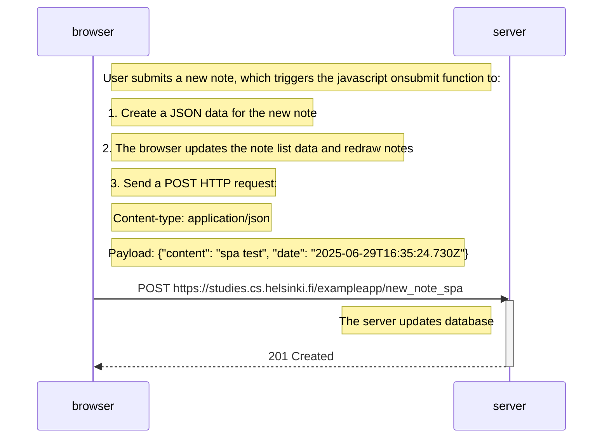

```mermaid
sequenceDiagram
    participant browser
    participant server

    Note right of browser: User submits a new note, which triggers the javascript onsubmit function to:
    Note right of browser: 1. Create a JSON data for the new note
    Note right of browser: 2. The browser updates the note list data and redraw notes
    Note right of browser: 3. Send a POST HTTP request:
    Note right of browser: Content-type: application/json
    Note right of browser: Payload: {"content": "spa test", "date": "2025-06-29T16:35:24.730Z"}

    browser->>server: POST https://studies.cs.helsinki.fi/exampleapp/new_note_spa
    activate server
    Note left of server: The server updates database
    server-->>browser: 201 Created
    deactivate server
```